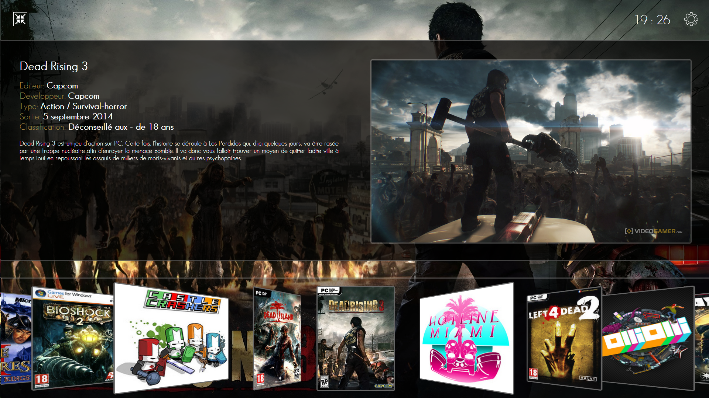

GameApp v0.4
============

Lancez vos jeux favoris via votre gamepad grâce à une interface adaptée et simplifiée.

Changelog
=========

Regardez le fichier [changelog.md](changelog.md)

Téléchargements
===============

Setup
-----

* Windows : <http://www.babeuloula.fr/fichiers/projets/gameapp-latest-win.zip>
* Mac OSX : <http://www.babeuloula.fr/fichiers/projets/gameapp-latest-osx.zip>

Github
------

`git clone https://github.com/https://github.com/babeuloula/GameApp`
`npm install`

Comment ça fonctionne ?
=======================

Les contrôles
-------------

* Flèche gauche et droite pour changer de jeu
* Entrée pour lancer le jeu
* Echap pour quitter l'application

Ajouter des jeux
----------------

* Lancez l'application
* Cliquez sur le bouton Paramètres en haut a droite
* Dans la nouvelle fenêtre, entrez le nom du jeu et cliquez sur le bouton Ajouter un jeu
* Sélectionnez le bon jeu si de base, GameApp aurait sélectionné le mauvais
* Vérifiez si les infos sont correctes, sinon changez les
* Inscrivez le fichier a lancer

Editer un jeu
-------------

* Cliquez sur le crayon à droite

Supprimer un jeu
----------------

* Cliquez sur la croix à droite

Cas d'utilisation des jeux Steam et UPlay
-----------------------------------------

Pour les jeux Steam et UPlay, il vous suffit d'indiquer dans le chemin d'accès au jeu :

* Steam : steam://ID_DU_JEU
* UPlay : uplay://ID_DU_JEU

Pour trouver ces informations, créez un raccourcis du jeu sur votre bureau grâce au logiciel et faites Clic Droit -> Propriétés

Compatibilité
=============

* GameApp est compatible PC et Mac
* Le système est responsive mais demande tout de même une résolution minimale de 1280*720

Choses prévues dans les versions futurs
=======================================

* Contrôller GameApp via un gamepad
* Proposer plusieurs types d'affichages

Si vous constatez le moindre bug, ou si vous avez des propositions n'hésitez pas.
Comme toutes les choses que je propose sur GitHub, vous pouvez réutilisez les sources comme bon vous semble. Par contre essayez juste de m'envoyer un mail pour me montrer vos créations.
Et si le coeur vous en dit, n'hésitez pas à me payer une bière, GameApp est sous licence Beerware.     

Remerciements
=============

* Roger Wang pour Node Webkit (<https://github.com/rogerwang/node-webkit>)
* Jamie "neiio" Green pour son icône (<http://neiio.deviantart.com/>)
* Jeuxvideo.com pour leur API (<http://www.jeuxvideo.com/>)
* Bennett Feely pour son loader animé en SVG (<http://codepen.io/bennettfeely/pen/lyJdw>)
* Et tous ceux que j'aurai ooublié